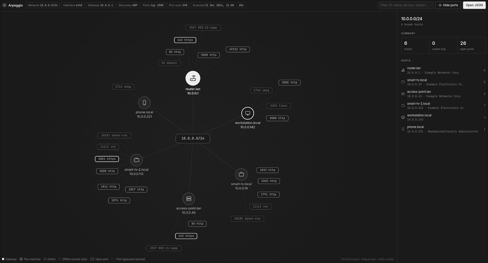
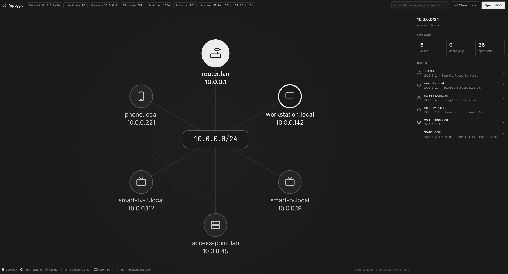

# Arpeggio

A local network scanner written in Rust. Arpeggio detects the subnet you're on and collects every host it can find, both from the OS's caches and by scanning. It then resolves hostnames, scans the most common TCP ports, fingerprints the services behind them and writes the result as a [Cytoscape.js](https://js.cytoscape.org/) topology in JSON.

> Ports showing



> Ports hidden



## How it works

A scan runs in six stages:

1. **Network detection.** Arpeggio picks the interface that holds the default route, along with its IPv4 address and the gateway. If the interface's network is larger than a /24, it scans the /24 that contains your own IP.
2. **Passive sources.** These are read before any packet is sent:
   - the OS ARP / neighbor cache
   - DHCP leases:
     - server leases from dnsmasq, ISC dhcpd and Kea
     - client leases from NetworkManager, systemd-networkd and dhclient
   - the hosts file
3. **Active discovery.** An ARP sweep of the whole subnet. If ARP isn't available, Arpeggio falls back to a TCP ping and then re-reads the ARP cache. That second read catches hosts that filter every port but still answer ARP.
4. **Name resolution**, all running in parallel:
   - reverse DNS
   - mDNS reverse lookups
   - DNS-SD service browsing over mDNS
   - NetBIOS node status
5. **Port scan.** A TCP connect scan of the top *N* ports (5000 by default), ranked by the frequency data of your local nmap install. Without nmap, Arpeggio scans a built-in list of about 1100 common ports instead. Hosts that are only known from caches or leases get scanned too, since they may be up and simply not answering discovery. On Linux, `--syn` makes the scan half-open instead: a bare SYN per port, classified by the reply, which never completes a handshake.
6. **Service detection** on every open port:
   - reads the passive banner (SSH, FTP, SMTP, POP3, IMAP, VNC, MySQL/MariaDB, Telnet, Redis…)
   - sends an HTTP probe and records the `Server` header and the page `<title>`
   - attempts a TLS handshake and reads the certificate CN and SANs; any name that looks like a fully qualified hostname is added to the host's names
   - if none of these works, falls back to the port's conventional name; these entries are marked `"detection": "port-table"`

## Building

You need a recent stable Rust toolchain. The project uses the 2024 edition.

```sh
cargo build --release
```

nmap is optional. If it's installed, Arpeggio reads its `nmap-services` file at runtime to rank ports (from `$NMAPDIR` or the standard install paths). The MAC vendor database (`data/ieee-oui.tsv`) is embedded in the binary; `scripts/ieee-oui.py` regenerates it from the IEEE registry.

## Running

```sh
# Scan the current subnet and write the topology to a file
./target/release/arpeggio -o scan.json

# Pick the interface and network explicitly
./target/release/arpeggio --iface eth0 --cidr 10.0.0.0/24 -o scan.json

# Quicker pass: fewer ports, shorter timeout
./target/release/arpeggio -p 1000 -t 500 -o scan.json
```

Progress goes to stderr and the JSON goes to stdout, unless you pass `-o`.

| Option | Default | Description |
|---|---|---|
| `-i, --iface` | default-route interface | Interface to use. On Windows this can be either the friendly name (`Ethernet`) or the adapter GUID. |
| `-c, --cidr` | interface network, narrowed to /24 | Network to scan. |
| `-p, --top-ports` | `5000` | How many of the most common TCP ports to scan. |
| `-t, --timeout-ms` | `1000` | TCP connect timeout. |
| `--concurrency` | `1000` | Maximum simultaneous connection attempts in a connect scan. Lower it if a router starts dropping connections under load. |
| `--syn` | off | Use a half-open SYN scan instead of TCP connect. Linux only, needs `CAP_NET_RAW`; falls back to connect otherwise. |
| `--rate` | `10000` | SYN probes per second in the first round; retries of unanswered ports go slower. Only used with `--syn`. |
| `-o, --output` | stdout | Output file. |

### Privileges

- **Linux.** The ARP sweep and `--syn` use raw sockets, so they need `CAP_NET_RAW`. You can grant that to the binary itself:

  ```sh
  sudo setcap cap_net_raw+ep target/release/arpeggio
  ```

  Rebuilding replaces the binary, so you have to run `setcap` again after every build. Without the capability, Arpeggio prints a warning and falls back to the TCP ping and the connect scan. Some DHCP lease files, such as NetworkManager's, are only readable by root and are skipped without an error.

- **Windows.** Discovery goes through the system's `SendARP`, so you don't need admin rights or Npcap. `--syn` is not available and falls back to the connect scan. The ARP cache comes from `GetIpNetTable2`. Windows has no lease files, so for adapters configured by DHCP, Arpeggio uses the adapter's gateway and DNS servers instead.

- **Other platforms.** If `/proc/net/route` is missing, interface detection falls back to the OS routing APIs. Discovery still uses the raw ARP sweep or the TCP ping fallback. `--syn` is not available and falls back to the connect scan. This path has not been tested.

> Only scan networks you own or are authorized to test.

## Output format

The output is one JSON document. The `elements` object can be passed straight to `cy.add()`. The topology is a star: a `subnet` node sits in the center and every host has an edge to it.

```jsonc
{
  "scan": {
    "started_at": 1700000000,          // Unix seconds
    "finished_at": 1700000016,
    "interface": "eth0",
    "local_ip": "192.168.0.10",
    "cidr": "192.168.0.0/24",
    "gateway": "192.168.0.1",
    "discovery": "arp",                // "arp" or "tcp" (fallback)
    "top_ports": 5000,
    "port_list": "nmap",               // "nmap" (local install) or "builtin"
    "scan_method": "connect"           // "connect" or "syn"
  },
  "elements": {
    "nodes": [
      { "data": { "id": "net:192.168.0.0/24", "label": "192.168.0.0/24", "type": "subnet" } },
      {
        "data": {
          "id": "host:192.168.0.1",
          "label": "router.lan",
          "type": "gateway",            // "gateway" | "self" | "host"
          "status": "online",           // "online" | "offline" (known only from caches/leases)
          "ip": "192.168.0.1",
          "mac": "aa:bb:cc:dd:ee:01",
          "vendor": "Example Networks",
          "hostnames": ["router.lan"],
          "sources": ["arp_cache", "arp_scan", "rdns", "route", "port_scan"],
          "online": true,
          "is_gateway": true,
          "is_self": false,
          "open_ports": 2,
          "ports": [
            {
              "port": 443,
              "protocol": "tcp",
              "service": "https",
              "product": "nginx",
              "version": "1.24.0",
              "tls": true,
              "info": "HTTP/1.1 200 OK | title: Router Admin",
              "banner": "HTTP/1.1 200 OK...",
              "cert": { "subject_cn": "router.lan", "sans": ["router.lan"] },
              "detection": "probe"      // "probe" | "port-table" (guessed from the port number)
            },
            {
              "port": 53,
              "protocol": "tcp",
              "service": "domain",
              "product": null,
              "version": null,
              "tls": false,
              "info": null,
              "banner": null,
              "cert": null,
              "detection": "port-table"
            }
          ],
          "mdns_services": [
            {
              "service": "_http._tcp",
              "instance": "Router",
              "port": 80,
              "target": "router.local",
              "txt": ["path=/"]
            }
          ]
        }
      }
    ],
    "edges": [
      { "data": { "id": "edge:192.168.0.1", "source": "host:192.168.0.1", "target": "net:192.168.0.0/24" } }
    ]
  }
}
```

### Host sources

Each host's `sources` array records every way that host was learned:

| Source | Meaning |
|---|---|
| `arp_cache` | Present in the OS ARP / neighbor cache |
| `dhcp_lease` | A lease handed out by a DHCP server running on this machine |
| `dhcp_client_lease` | Router, DHCP server or DNS server taken from this machine's own lease |
| `hosts_file` | Listed in `/etc/hosts` (or the Windows hosts file) |
| `arp_scan` | Answered the ARP sweep |
| `tcp_ping` | Accepted or refused a TCP connection during the fallback ping |
| `arp_resolve` | Got a newly resolved ARP entry during the fallback ping |
| `rdns` | Reverse DNS returned a name |
| `mdns` | Answered an mDNS query |
| `mdns_browse` | Advertises DNS-SD services |
| `netbios` | Answered a NetBIOS node status query |
| `tls_cert` | A TLS certificate supplied one of its hostnames |
| `port_scan` | Has at least one open port |
| `route` | Is the default gateway |
| `self` | Is the machine running the scan |

## Viewer

`viewer/index.html` is a single static page that renders the JSON with Cytoscape.js.

It has two parts:
- a graph with device icons, where each host's open ports fan out around it as their own nodes; **Hide ports** (or `P`) toggles them
- a side panel with each host's identity, open ports, certificates and mDNS services, plus a filter box

You can load a scan in two ways:

- Open the file directly in a browser, then drag and drop a scan onto the page or click **Open JSON**.
- Serve the folder and point the page at a file:

  ```sh
  cd viewer && cp ../scan.json . && python -m http.server
  # then open http://localhost:8000/?src=scan.json
  ```

The device icons (router, computer, phone, printer, TV) are a best-effort guess. The viewer infers them from hostnames, MAC vendor, open ports and mDNS services. They are not part of the scan data.

## Limitations

- Only TCP is scanned. UDP services are only seen through mDNS and NetBIOS.
- Service detection is intentionally lightweight. It's a set of banner and HTTP/TLS probes, not a full nmap-style probe database.
- On Windows, connections to closed ports can take noticeably longer to fail than on Linux, so the port scan runs slower there.
- Some routers rate-limit bursts of connections. A connect scan cannot tell a port refused under load from a genuinely closed one, so an overloaded device can hide open ports. If results vary between runs, lower `--concurrency` or try `--syn`.

## Third-party data

`data/ieee-oui.tsv` is built from the [IEEE Registration Authority](https://standards-oui.ieee.org/)'s public MA-L, MA-M and MA-S assignment listings.

## Author

Developed by JohnnYoru.
